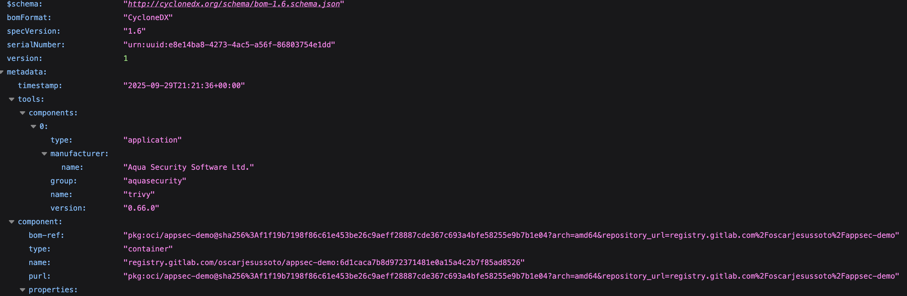

# AppSec Demo Project

[](https://gitlab.com/oscarjesussoto/appsec-demo/-/pipelines)
[](https://gitlab.com/oscarjesussoto/appsec-demo/-/jobs)

---

## 📌 Overview
This project is a **security-focused demo application** built to showcase 
modern DevSecOps practices.  
The pipeline integrates automated **testing, static analysis, software 
composition analysis, container scanning, SBOM generation, and secret 
detection**.  

The goal is to demonstrate a **shift-left security approach** where 
vulnerabilities are detected early and integrated into the CI/CD workflow.

---

## ⚙️ Tech Stack
- **Language:** Python 3.12  
- **Testing:** Pytest + Coverage.py  
- **Containerization:** Docker  
- **CI/CD:** GitLab CI/CD  
- **Security Tools:**
  - [Semgrep](https://semgrep.dev) → Static Application Security Testing 
(SAST)
  - [Snyk](https://snyk.io) → Software Composition Analysis (SCA)
  - [Trivy](https://aquasecurity.github.io/trivy) → Container scanning + 
SBOM (CycloneDX)
  - [Gitleaks](https://github.com/gitleaks/gitleaks) → Secrets detection

---

## 🔐 CI/CD Pipeline
The pipeline is organized into multiple stages:

1. **Test**  
   - Runs `pytest` with coverage thresholds.  
   - Fails if coverage is below **80%**.  

2. **SAST (Semgrep)**  
   - Scans code for security issues and misconfigurations.  
   - Generates GitLab-compatible security reports (`gl-sast-report.json`).  

3. **SCA (Snyk)**  
   - Scans `requirements.txt` for vulnerable dependencies.  
   - Blocks merge if high/critical issues are detected.  

4. **Build (Docker)**  
   - Builds and pushes Docker images to GitLab’s registry.  

5. **Container Scan (Trivy)**  
   - Scans the built Docker image for vulnerabilities.  
   - Enforces fail policy on **HIGH/CRITICAL** issues.  

6. **SBOM (CycloneDX)**  
   - Exports a Software Bill of Materials (`sbom.cdx.json`) for supply 
chain visibility.  

7. **Secrets Detection (Gitleaks)**  
   - Scans the repo for leaked credentials and API keys.  

8. **Deploy (Staging)**  
   - Simulates a deployment by running the image in a container.  
   - Performs a `/health` check.  

---

## 📊 Reports & Artifacts
- **Test Coverage:** `coverage.xml` (Cobertura format)  
- **JUnit Test Report:** `junit.xml`  
- **SAST Report:** `gl-sast-report.json`  
- **SBOM:** `sbom.cdx.json`  

All reports are stored as GitLab artifacts for visibility and auditing.

---

## 🛡️ Security Gates
This project enforces **fail-fast security policies**:
- Build fails if:
  - Coverage < 80%  
  - Critical/High vulnerabilities found (Snyk or Trivy)  
  - Secrets detected (Gitleaks)  

This simulates **real-world security gates** for enterprise CI/CD 
pipelines.

---

## 📸 Screenshots

### ✅ Pipeline Passing
  
*All CI/CD stages (test, SAST, SCA, build, container scan, SBOM) passing 
successfully in GitLab.*

---

### 🔍 Snyk Vulnerability Report
  

---

### 🐳 Trivy Container Scan
  
*Docker image scan results showing no HIGH/CRITICAL vulnerabilities.*

---

### 📜 SBOM (CycloneDX)
  
*Exported Software Bill of Materials (`sbom.cdx.json`) visualized for 
supply chain transparency.*

---

### 🔑 Secrets Detection (Gitleaks)
  
*Secrets detection report blocking leaked API keys or credentials.*


---

## 🚀 How to Run Locally
```bash
# Clone repo
git clone https://gitlab.com/oscarjesussoto/appsec-demo.git
cd appsec-demo

# Install dependencies
pip install -r requirements.txt

# Run tests with coverage
pytest --cov=app --cov-report=term-missing

# Build Docker image
docker build -t appsec-demo:local .
docker run -p 8000:8000 appsec-demo:local

